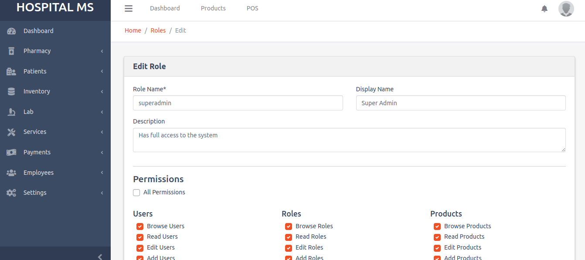

# Africaner Hospital Mgt System

## Employee Management

### Create Employee

- Add new employees to the system.
- Provide details such as first name, last name, gender, password, email, role assignment, designation, and department.

### Edit Employee

- Modify employee information.
- Update fields like last name, designation, etc.

### Delete Employee

- Remove employees from the system.
- Use employee identifier for deletion.

### Assign Roles, Designations, and Departments

- Assign specific roles to employees.
- Specify designations and departments for organizational clarity.

Example:

> In the Employee Management module, users can efficiently handle the creation, editing, and deletion of employees. Additionally, they can assign roles, designations, and departments to ensure proper organization and access control.

<table>
  <tr>
    <td></td>
    <td></td>
  </tr>
</table>

## Designation Management

### Create Designation

- Add new designations to the system.

### Edit Designation

- Modify existing designations.

### Delete Designation

- Remove designations from the system.

Example:

> The Designation Management module allows users to efficiently create, edit, and delete designations as needed for organizational structure and clarity.

## Department Management

### Create Department

- Add new departments to the system.

### Edit Department

- Modify existing department details.

### Delete Department

- Remove departments from the system.

Example:

> The Department Management module empowers users to seamlessly create, edit, and delete departments, ensuring effective organization and streamlined processes.

## Role Management

### Create Role

- Add new roles to the system.

### Edit Role

- Modify existing role details, including permissions.
- Adjust permissions to control user actions.

### Delete Role

- Remove roles from the system.

Example:

> Role Management allows administrators to create, edit, and delete roles within the system. When editing a role, administrators can adjust permissions to precisely define the actions users with that role are authorized to perform. This ensures a fine-grained access control mechanism tailored to the organization's needs.

<table>
  <tr>
    <td></td>
    <td></td>
  </tr>
</table>

## Services Management

### Create Service

- Add new services to the system.

### Edit Service

- Modify existing service details.

### Delete Service

- Remove services from the system.

### View Service

- Access detailed information about a service, including associated medical acts and prices.

### Manage Medical Acts

- Add, edit, or delete medical acts associated with a service.
- Specify prices for each medical act.

Example:

> Services Management enables users to create, edit, and delete services within the system. When viewing a service, administrators can access detailed information, including associated medical acts and their respective prices. Additionally, the module allows for the management of medical acts, allowing customization of services offered.

<table>
  <tr>
    <td></td>
    <td></td>
  </tr>
</table>
